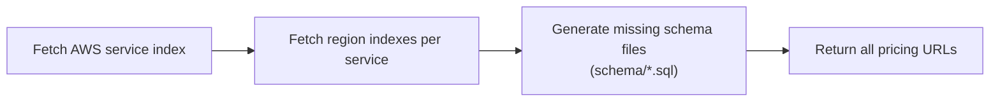
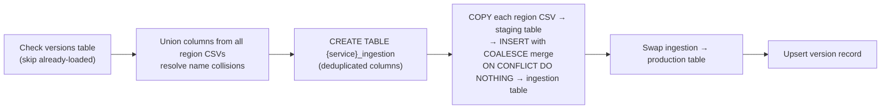

# AWS Pricing List Loader

Crawls the [AWS Pricing API](https://pricing.us-east-1.amazonaws.com) to discover all service and savings plan pricing URLs, and bulk-loads every region's pricing CSV into PostgreSQL using an ingestion/swap pattern.

Exposed as a FastAPI HTTP service, with a CLI for local use and a Cloud Run Job entry point for batch execution.

## Setup

### Docker (recommended)

```bash
cp .env.example .env  # fill in Postgres credentials
docker compose up --build -d
```

Starts both PostgreSQL and the API. The API automatically runs any pending DB migrations on startup. Interactive docs at `http://localhost:8000/docs`.

### Docker with SSL (GCP Cloud SQL or local mTLS test)

For GCP Cloud SQL, download `server-ca.pem`, `client-cert.pem`, and `client-key.pem` from the Console → Cloud SQL → your instance → Connections → SSL, and place them in `certs/`.

For local testing, generate self-signed equivalents instead:

```bash
bash scripts/gen-dev-certs.sh           # creates certs/ with matching file names
docker compose -f docker-compose.yml -f docker-compose.ssl.yml up --build -d
```

The SSL compose override enables TLS on the PostgreSQL container and injects these env vars into `api`:

| Env var | Value (in container) |
|---|---|
| `POSTGRES_SSL_MODE` | `verify-ca` |
| `POSTGRES_SSL_ROOTCERT` | `/app/certs/server-ca.pem` |
| `POSTGRES_SSL_CERT` | `/app/certs/client-cert.pem` |
| `POSTGRES_SSL_KEY` | `/app/certs/client-key.pem` |

For local dev without Docker, set these vars in `.env` pointing to your local cert paths.

### Local development

```bash
pip install -r requirements-dev.txt
cp .env.example .env  # fill in Postgres credentials
docker compose up -d db  # start Postgres only
uvicorn app.main:app --reload  # migrations run automatically on startup
```

## Environment variables

All vars are read from `.env` (or the shell environment). Copy `.env.example` to get started.

| Variable | Default | Required | Description |
|---|---|---|---|
| `POSTGRES_HOST` | — | Yes | PostgreSQL host |
| `POSTGRES_PORT` | `5432` | No | PostgreSQL port |
| `POSTGRES_DB` | — | Yes | Database name |
| `POSTGRES_USER` | — | Yes | Database user |
| `POSTGRES_PASSWORD` | — | Yes | Database password |
| `POSTGRES_SSL_MODE` | — | No | SSL mode (e.g. `verify-ca`); omit for plain TCP |
| `POSTGRES_SSL_ROOTCERT` | — | No | Path to server CA cert |
| `POSTGRES_SSL_CERT` | — | No | Path to client cert |
| `POSTGRES_SSL_KEY` | — | No | Path to client private key |

## API

| Method | Path | Description |
|--------|------|-------------|
| `GET` | `/health` | Liveness check — returns `{"status":"ok"}` |
| `GET` | `/pricing/urls` | List all discovered pricing URLs; generates any missing schema files |
| `POST` | `/pricing/load` | Load pricing data into PostgreSQL (blocks until complete) |
| `GET` | `/versions` | List all loaded service versions |

**GET /pricing/urls**



**POST /pricing/load**



`POST /pricing/load` accepts an optional JSON body to target a single service:

```json
{ "name": "comprehend" }
```

Response:

```json
{ "loaded": 14, "services": 1, "elapsed_seconds": 42.3 }
```

## CLI

The CLI shares the same service layer as the API.

### List pricing URLs

```bash
python fetch_pricing_index.py
python fetch_pricing_index.py > output.txt  # save to file
```

Output (stdout) is a CSV with columns: `type, name, region, csv_url, publication_date`.

### Load pricing data into PostgreSQL

```bash
python fetch_pricing_index.py --load
python fetch_pricing_index.py --load --name comprehend
python fetch_pricing_index.py --load --name AWSDatabaseSavingsPlans
```

Already-loaded versions are skipped automatically (tracked in `aws_pricing_list_versions`).

## Cloud Run Job

`run_job.py` is designed to run as a [Google Cloud Run Job](https://cloud.google.com/run/docs/create-jobs) (one-time batch execution). It runs three steps in sequence, exiting with code 1 on any failure so the job runtime can detect and retry failures.

### Steps

1. **DB migrations** — applies any pending SQL migrations (same as API startup)
2. **Version check** — queries current loaded versions, discovers how many service/region entries have new data available
3. **Load** — streams and loads all new pricing CSVs into PostgreSQL

### Usage

```bash
# Load all services with new versions
python run_job.py

# Load a single service (useful for testing)
python run_job.py --name AWSComputeSavingsPlan

# Force reload all services (ignore already-loaded versions)
python run_job.py --force

# Force reload a single service
python run_job.py --name AWSComputeSavingsPlan --force
```

### Running as a Cloud Run Job

The same container image serves both the API and the job. The container entrypoint passes arguments through, so override the CMD via `--args`:

```bash
# Create the job
gcloud run jobs create aws-pricing-loader \
  --image REGION-docker.pkg.dev/PROJECT/REPO/IMAGE \
  --args "python,run_job.py" \
  --set-env-vars "POSTGRES_HOST=...,POSTGRES_DB=...,POSTGRES_USER=...,POSTGRES_PASSWORD=..."

# Execute the job
gcloud run jobs execute aws-pricing-loader

# Force reload all services (skip version check)
gcloud run jobs update aws-pricing-loader \
  --args "python,run_job.py,--force"
gcloud run jobs execute aws-pricing-loader

# Target a single service
gcloud run jobs update aws-pricing-loader \
  --args "python,run_job.py,--name,comprehend"
gcloud run jobs execute aws-pricing-loader
```

Commas in `--args` delimit separate argv entries.

## How loading works

For each service with new data:

1. Fetches column headers from all region CSVs concurrently and unions them. Columns that normalise to the same snake_case name (e.g. `StorageType` and `Storage Type` → `storage_type`) are detected as collisions: the staging representation uses `_2`/`_3` suffixes to preserve CSV positions, while the ingestion table schema keeps only the base name. Generates and executes a `CREATE TABLE` DDL directly to the DB.
2. Streams each region's CSV, strips the first 6 lines (metadata + header), and bulk-loads via `COPY … FROM STDIN` into a temporary `UNLOGGED` staging table (created with all staging columns including collision suffixes, all as `TEXT`). Rows are then merged into the ingestion table with `INSERT … SELECT … ON CONFLICT (rate_code, pricing_region) DO NOTHING`, using `COALESCE` to collapse suffix variants into a single column. Columns with non-TEXT types (e.g. `effective_date DATE`, `price_per_unit DECIMAL`) are cast via `NULLIF(…, '')::TYPE` to handle both empty strings and NULLs. Global items that appear identically in multiple region CSVs are silently deduplicated.
3. Atomically swaps the ingestion table into production: renames the existing `{service}` table to `drop_{service}`, renames `{service}_ingestion` to `{service}`, then drops `drop_{service}`.
4. Records the loaded version in `aws_pricing_list_versions` so subsequent runs skip it.

Table names use the original AWS service name (e.g. `AmazonEC2`, `AWSDatabaseSavingsPlans`), not snake_case.

## Schema files

Schema files in `schema/` are generated during URL listing (both CLI listing mode and `GET /pricing/urls`). Each file (`{service}_ingestion.sql`) contains a `CREATE TABLE` + index DDL. In `--load` mode the DDL is generated on-the-fly and executed directly.

To force schema regeneration, delete the corresponding `.sql` file and re-run in listing mode.

## Migrations

DB migrations live in `migrations/` as numbered SQL files (`0001_*.sql`, `0002_*.sql`, …). They are applied automatically in filename order every time the API starts. Applied migrations are tracked in the `schema_migrations` table so each file runs exactly once.

To add a migration:

```bash
# Create the file
echo "ALTER TABLE aws_pricing_list_versions ADD COLUMN IF NOT EXISTS notes TEXT;" \
  > migrations/0002_add_notes_column.sql

# Deploy — runs on next startup
uvicorn app.main:app
# Log: Applied migration: 0002_add_notes_column.sql
```

## Testing

### Unit and API tests

No database or network connection required:

```bash
pip install -r requirements-dev.txt
pytest tests/
```

Covers:
- `tests/test_aws_client.py` — `to_snake_case` with real AWS service names
- `tests/test_schema_builder.py` — column type overrides, index name truncation, DDL generation, collision detection and merge_map
- `tests/test_loader.py` — column union, collision deduplication, COALESCE INSERT, staging/ingestion schema split
- `tests/test_api.py` — all endpoints via FastAPI `TestClient` with mocked service layer
- `tests/test_migrations.py` — migration runner: ordering, skip-applied, connection cleanup
- `tests/test_main.py` — lifespan calls `run_migrations()` on startup

### Integration tests

Requires a running PostgreSQL instance (`.env` configured):

```bash
pytest test_create_table.py
```

### Manual smoke tests

Smoke test a savings plan:

```bash
psql -c "DELETE FROM aws_pricing_list_versions WHERE name = 'aws_database_savings_plans';"
python fetch_pricing_index.py --load --name AWSDatabaseSavingsPlans
# Expected: [TABLE] created → [COPY] 36 regions → [SWAP] → [VERSION]
```

Smoke test a service:

```bash
psql -c "DELETE FROM aws_pricing_list_versions WHERE name = 'comprehend';"
python fetch_pricing_index.py --load --name comprehend
# Expected: [TABLE] created → [COPY] 14 regions → [SWAP] → [VERSION]
```

## References

See [references.md](references.md) for AWS Pricing API documentation links and JSON/CSV structure details.
